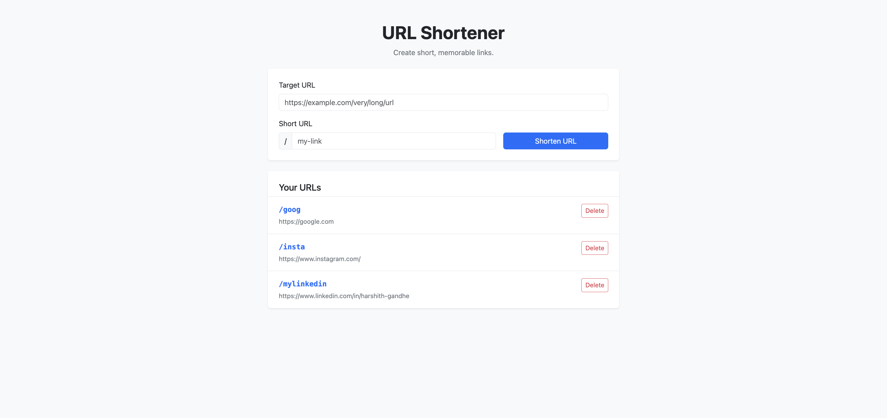
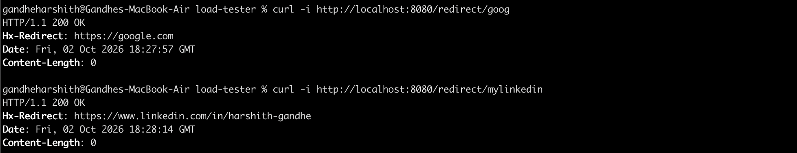

# Go Mini Projects

## URL Shortner

A lightweight URL shortener built with a Go backend and HTMX frontend. It supports creating custom short URLs, redirecting to original URLs, and deleting shortened links with server-rendered HTML and minimal JavaScript.

> Start Dev server with 

```bash
cd url-shortner
docker compose up
```





